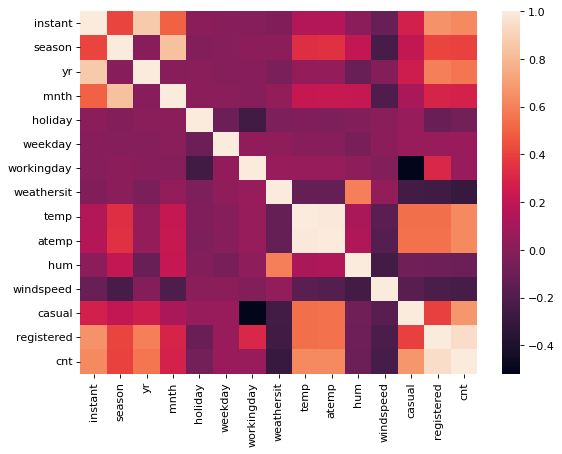
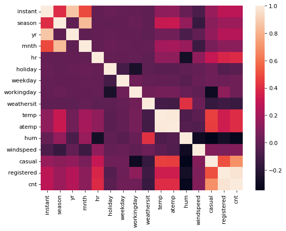

```python
import pandas as pd 
import numpy as np 
from matplotlib import pyplot as plt 
import seaborn as sns 
```


```python
df_day = pd.read_csv("data/day.csv")
df_hour = pd.read_csv("data/hour.csv")
```


```python
df_hour.head()
```


<div>
<style scoped>
    .dataframe tbody tr th:only-of-type {
        vertical-align: middle;
    }

    .dataframe tbody tr th {
        vertical-align: top;
    }

    .dataframe thead th {
        text-align: right;
    }
</style>
<table border="1" class="dataframe">
  <thead>
    <tr style="text-align: right;">
      <th></th>
      <th>instant</th>
      <th>dteday</th>
      <th>season</th>
      <th>yr</th>
      <th>mnth</th>
      <th>hr</th>
      <th>holiday</th>
      <th>weekday</th>
      <th>workingday</th>
      <th>weathersit</th>
      <th>temp</th>
      <th>atemp</th>
      <th>hum</th>
      <th>windspeed</th>
      <th>casual</th>
      <th>registered</th>
      <th>cnt</th>
    </tr>
  </thead>
  <tbody>
    <tr>
      <th>0</th>
      <td>1</td>
      <td>2011-01-01</td>
      <td>1</td>
      <td>0</td>
      <td>1</td>
      <td>0</td>
      <td>0</td>
      <td>6</td>
      <td>0</td>
      <td>1</td>
      <td>0.24</td>
      <td>0.2879</td>
      <td>0.81</td>
      <td>0.0</td>
      <td>3</td>
      <td>13</td>
      <td>16</td>
    </tr>
    <tr>
      <th>1</th>
      <td>2</td>
      <td>2011-01-01</td>
      <td>1</td>
      <td>0</td>
      <td>1</td>
      <td>1</td>
      <td>0</td>
      <td>6</td>
      <td>0</td>
      <td>1</td>
      <td>0.22</td>
      <td>0.2727</td>
      <td>0.80</td>
      <td>0.0</td>
      <td>8</td>
      <td>32</td>
      <td>40</td>
    </tr>
    <tr>
      <th>2</th>
      <td>3</td>
      <td>2011-01-01</td>
      <td>1</td>
      <td>0</td>
      <td>1</td>
      <td>2</td>
      <td>0</td>
      <td>6</td>
      <td>0</td>
      <td>1</td>
      <td>0.22</td>
      <td>0.2727</td>
      <td>0.80</td>
      <td>0.0</td>
      <td>5</td>
      <td>27</td>
      <td>32</td>
    </tr>
    <tr>
      <th>3</th>
      <td>4</td>
      <td>2011-01-01</td>
      <td>1</td>
      <td>0</td>
      <td>1</td>
      <td>3</td>
      <td>0</td>
      <td>6</td>
      <td>0</td>
      <td>1</td>
      <td>0.24</td>
      <td>0.2879</td>
      <td>0.75</td>
      <td>0.0</td>
      <td>3</td>
      <td>10</td>
      <td>13</td>
    </tr>
    <tr>
      <th>4</th>
      <td>5</td>
      <td>2011-01-01</td>
      <td>1</td>
      <td>0</td>
      <td>1</td>
      <td>4</td>
      <td>0</td>
      <td>6</td>
      <td>0</td>
      <td>1</td>
      <td>0.24</td>
      <td>0.2879</td>
      <td>0.75</td>
      <td>0.0</td>
      <td>0</td>
      <td>1</td>
      <td>1</td>
    </tr>
  </tbody>
</table>
</div>


```python
df_day.head()
```


<div>
<style scoped>
    .dataframe tbody tr th:only-of-type {
        vertical-align: middle;
    }

    .dataframe tbody tr th {
        vertical-align: top;
    }

    .dataframe thead th {
        text-align: right;
    }
</style>
<table border="1" class="dataframe">
  <thead>
    <tr style="text-align: right;">
      <th></th>
      <th>instant</th>
      <th>dteday</th>
      <th>season</th>
      <th>yr</th>
      <th>mnth</th>
      <th>holiday</th>
      <th>weekday</th>
      <th>workingday</th>
      <th>weathersit</th>
      <th>temp</th>
      <th>atemp</th>
      <th>hum</th>
      <th>windspeed</th>
      <th>casual</th>
      <th>registered</th>
      <th>cnt</th>
    </tr>
  </thead>
  <tbody>
    <tr>
      <th>0</th>
      <td>1</td>
      <td>2011-01-01</td>
      <td>1</td>
      <td>0</td>
      <td>1</td>
      <td>0</td>
      <td>6</td>
      <td>0</td>
      <td>2</td>
      <td>0.344167</td>
      <td>0.363625</td>
      <td>0.805833</td>
      <td>0.160446</td>
      <td>331</td>
      <td>654</td>
      <td>985</td>
    </tr>
    <tr>
      <th>1</th>
      <td>2</td>
      <td>2011-01-02</td>
      <td>1</td>
      <td>0</td>
      <td>1</td>
      <td>0</td>
      <td>0</td>
      <td>0</td>
      <td>2</td>
      <td>0.363478</td>
      <td>0.353739</td>
      <td>0.696087</td>
      <td>0.248539</td>
      <td>131</td>
      <td>670</td>
      <td>801</td>
    </tr>
    <tr>
      <th>2</th>
      <td>3</td>
      <td>2011-01-03</td>
      <td>1</td>
      <td>0</td>
      <td>1</td>
      <td>0</td>
      <td>1</td>
      <td>1</td>
      <td>1</td>
      <td>0.196364</td>
      <td>0.189405</td>
      <td>0.437273</td>
      <td>0.248309</td>
      <td>120</td>
      <td>1229</td>
      <td>1349</td>
    </tr>
    <tr>
      <th>3</th>
      <td>4</td>
      <td>2011-01-04</td>
      <td>1</td>
      <td>0</td>
      <td>1</td>
      <td>0</td>
      <td>2</td>
      <td>1</td>
      <td>1</td>
      <td>0.200000</td>
      <td>0.212122</td>
      <td>0.590435</td>
      <td>0.160296</td>
      <td>108</td>
      <td>1454</td>
      <td>1562</td>
    </tr>
    <tr>
      <th>4</th>
      <td>5</td>
      <td>2011-01-05</td>
      <td>1</td>
      <td>0</td>
      <td>1</td>
      <td>0</td>
      <td>3</td>
      <td>1</td>
      <td>1</td>
      <td>0.226957</td>
      <td>0.229270</td>
      <td>0.436957</td>
      <td>0.186900</td>
      <td>82</td>
      <td>1518</td>
      <td>1600</td>
    </tr>
  </tbody>
</table>
</div>


```python
df_day.info()
```

    <class 'pandas.core.frame.DataFrame'>
    RangeIndex: 731 entries, 0 to 730
    Data columns (total 16 columns):
     #   Column      Non-Null Count  Dtype  
    ---  ------      --------------  -----  
     0   instant     731 non-null    int64  
     1   dteday      731 non-null    object 
     2   season      731 non-null    int64  
     3   yr          731 non-null    int64  
     4   mnth        731 non-null    int64  
     5   holiday     731 non-null    int64  
     6   weekday     731 non-null    int64  
     7   workingday  731 non-null    int64  
     8   weathersit  731 non-null    int64  
     9   temp        731 non-null    float64
     10  atemp       731 non-null    float64
     11  hum         731 non-null    float64
     12  windspeed   731 non-null    float64
     13  casual      731 non-null    int64  
     14  registered  731 non-null    int64  
     15  cnt         731 non-null    int64  
    dtypes: float64(4), int64(11), object(1)
    memory usage: 91.5+ KB
    


```python
df_day.describe()
```


<div>
<style scoped>
    .dataframe tbody tr th:only-of-type {
        vertical-align: middle;
    }

    .dataframe tbody tr th {
        vertical-align: top;
    }

    .dataframe thead th {
        text-align: right;
    }
</style>
<table border="1" class="dataframe">
  <thead>
    <tr style="text-align: right;">
      <th></th>
      <th>instant</th>
      <th>season</th>
      <th>yr</th>
      <th>mnth</th>
      <th>holiday</th>
      <th>weekday</th>
      <th>workingday</th>
      <th>weathersit</th>
      <th>temp</th>
      <th>atemp</th>
      <th>hum</th>
      <th>windspeed</th>
      <th>casual</th>
      <th>registered</th>
      <th>cnt</th>
    </tr>
  </thead>
  <tbody>
    <tr>
      <th>count</th>
      <td>731.000000</td>
      <td>731.000000</td>
      <td>731.000000</td>
      <td>731.000000</td>
      <td>731.000000</td>
      <td>731.000000</td>
      <td>731.000000</td>
      <td>731.000000</td>
      <td>731.000000</td>
      <td>731.000000</td>
      <td>731.000000</td>
      <td>731.000000</td>
      <td>731.000000</td>
      <td>731.000000</td>
      <td>731.000000</td>
    </tr>
    <tr>
      <th>mean</th>
      <td>366.000000</td>
      <td>2.496580</td>
      <td>0.500684</td>
      <td>6.519836</td>
      <td>0.028728</td>
      <td>2.997264</td>
      <td>0.683995</td>
      <td>1.395349</td>
      <td>0.495385</td>
      <td>0.474354</td>
      <td>0.627894</td>
      <td>0.190486</td>
      <td>848.176471</td>
      <td>3656.172367</td>
      <td>4504.348837</td>
    </tr>
    <tr>
      <th>std</th>
      <td>211.165812</td>
      <td>1.110807</td>
      <td>0.500342</td>
      <td>3.451913</td>
      <td>0.167155</td>
      <td>2.004787</td>
      <td>0.465233</td>
      <td>0.544894</td>
      <td>0.183051</td>
      <td>0.162961</td>
      <td>0.142429</td>
      <td>0.077498</td>
      <td>686.622488</td>
      <td>1560.256377</td>
      <td>1937.211452</td>
    </tr>
    <tr>
      <th>min</th>
      <td>1.000000</td>
      <td>1.000000</td>
      <td>0.000000</td>
      <td>1.000000</td>
      <td>0.000000</td>
      <td>0.000000</td>
      <td>0.000000</td>
      <td>1.000000</td>
      <td>0.059130</td>
      <td>0.079070</td>
      <td>0.000000</td>
      <td>0.022392</td>
      <td>2.000000</td>
      <td>20.000000</td>
      <td>22.000000</td>
    </tr>
    <tr>
      <th>25%</th>
      <td>183.500000</td>
      <td>2.000000</td>
      <td>0.000000</td>
      <td>4.000000</td>
      <td>0.000000</td>
      <td>1.000000</td>
      <td>0.000000</td>
      <td>1.000000</td>
      <td>0.337083</td>
      <td>0.337842</td>
      <td>0.520000</td>
      <td>0.134950</td>
      <td>315.500000</td>
      <td>2497.000000</td>
      <td>3152.000000</td>
    </tr>
    <tr>
      <th>50%</th>
      <td>366.000000</td>
      <td>3.000000</td>
      <td>1.000000</td>
      <td>7.000000</td>
      <td>0.000000</td>
      <td>3.000000</td>
      <td>1.000000</td>
      <td>1.000000</td>
      <td>0.498333</td>
      <td>0.486733</td>
      <td>0.626667</td>
      <td>0.180975</td>
      <td>713.000000</td>
      <td>3662.000000</td>
      <td>4548.000000</td>
    </tr>
    <tr>
      <th>75%</th>
      <td>548.500000</td>
      <td>3.000000</td>
      <td>1.000000</td>
      <td>10.000000</td>
      <td>0.000000</td>
      <td>5.000000</td>
      <td>1.000000</td>
      <td>2.000000</td>
      <td>0.655417</td>
      <td>0.608602</td>
      <td>0.730209</td>
      <td>0.233214</td>
      <td>1096.000000</td>
      <td>4776.500000</td>
      <td>5956.000000</td>
    </tr>
    <tr>
      <th>max</th>
      <td>731.000000</td>
      <td>4.000000</td>
      <td>1.000000</td>
      <td>12.000000</td>
      <td>1.000000</td>
      <td>6.000000</td>
      <td>1.000000</td>
      <td>3.000000</td>
      <td>0.861667</td>
      <td>0.840896</td>
      <td>0.972500</td>
      <td>0.507463</td>
      <td>3410.000000</td>
      <td>6946.000000</td>
      <td>8714.000000</td>
    </tr>
  </tbody>
</table>
</div>


```python
df_hour.info()
```

    <class 'pandas.core.frame.DataFrame'>
    RangeIndex: 17379 entries, 0 to 17378
    Data columns (total 17 columns):
     #   Column      Non-Null Count  Dtype  
    ---  ------      --------------  -----  
     0   instant     17379 non-null  int64  
     1   dteday      17379 non-null  object 
     2   season      17379 non-null  int64  
     3   yr          17379 non-null  int64  
     4   mnth        17379 non-null  int64  
     5   hr          17379 non-null  int64  
     6   holiday     17379 non-null  int64  
     7   weekday     17379 non-null  int64  
     8   workingday  17379 non-null  int64  
     9   weathersit  17379 non-null  int64  
     10  temp        17379 non-null  float64
     11  atemp       17379 non-null  float64
     12  hum         17379 non-null  float64
     13  windspeed   17379 non-null  float64
     14  casual      17379 non-null  int64  
     15  registered  17379 non-null  int64  
     16  cnt         17379 non-null  int64  
    dtypes: float64(4), int64(12), object(1)
    memory usage: 2.3+ MB
    


```python
df_hour.describe()
```


<div>
<style scoped>
    .dataframe tbody tr th:only-of-type {
        vertical-align: middle;
    }

    .dataframe tbody tr th {
        vertical-align: top;
    }

    .dataframe thead th {
        text-align: right;
    }
</style>
<table border="1" class="dataframe">
  <thead>
    <tr style="text-align: right;">
      <th></th>
      <th>instant</th>
      <th>season</th>
      <th>yr</th>
      <th>mnth</th>
      <th>hr</th>
      <th>holiday</th>
      <th>weekday</th>
      <th>workingday</th>
      <th>weathersit</th>
      <th>temp</th>
      <th>atemp</th>
      <th>hum</th>
      <th>windspeed</th>
      <th>casual</th>
      <th>registered</th>
      <th>cnt</th>
    </tr>
  </thead>
  <tbody>
    <tr>
      <th>count</th>
      <td>17379.0000</td>
      <td>17379.000000</td>
      <td>17379.000000</td>
      <td>17379.000000</td>
      <td>17379.000000</td>
      <td>17379.000000</td>
      <td>17379.000000</td>
      <td>17379.000000</td>
      <td>17379.000000</td>
      <td>17379.000000</td>
      <td>17379.000000</td>
      <td>17379.000000</td>
      <td>17379.000000</td>
      <td>17379.000000</td>
      <td>17379.000000</td>
      <td>17379.000000</td>
    </tr>
    <tr>
      <th>mean</th>
      <td>8690.0000</td>
      <td>2.501640</td>
      <td>0.502561</td>
      <td>6.537775</td>
      <td>11.546752</td>
      <td>0.028770</td>
      <td>3.003683</td>
      <td>0.682721</td>
      <td>1.425283</td>
      <td>0.496987</td>
      <td>0.475775</td>
      <td>0.627229</td>
      <td>0.190098</td>
      <td>35.676218</td>
      <td>153.786869</td>
      <td>189.463088</td>
    </tr>
    <tr>
      <th>std</th>
      <td>5017.0295</td>
      <td>1.106918</td>
      <td>0.500008</td>
      <td>3.438776</td>
      <td>6.914405</td>
      <td>0.167165</td>
      <td>2.005771</td>
      <td>0.465431</td>
      <td>0.639357</td>
      <td>0.192556</td>
      <td>0.171850</td>
      <td>0.192930</td>
      <td>0.122340</td>
      <td>49.305030</td>
      <td>151.357286</td>
      <td>181.387599</td>
    </tr>
    <tr>
      <th>min</th>
      <td>1.0000</td>
      <td>1.000000</td>
      <td>0.000000</td>
      <td>1.000000</td>
      <td>0.000000</td>
      <td>0.000000</td>
      <td>0.000000</td>
      <td>0.000000</td>
      <td>1.000000</td>
      <td>0.020000</td>
      <td>0.000000</td>
      <td>0.000000</td>
      <td>0.000000</td>
      <td>0.000000</td>
      <td>0.000000</td>
      <td>1.000000</td>
    </tr>
    <tr>
      <th>25%</th>
      <td>4345.5000</td>
      <td>2.000000</td>
      <td>0.000000</td>
      <td>4.000000</td>
      <td>6.000000</td>
      <td>0.000000</td>
      <td>1.000000</td>
      <td>0.000000</td>
      <td>1.000000</td>
      <td>0.340000</td>
      <td>0.333300</td>
      <td>0.480000</td>
      <td>0.104500</td>
      <td>4.000000</td>
      <td>34.000000</td>
      <td>40.000000</td>
    </tr>
    <tr>
      <th>50%</th>
      <td>8690.0000</td>
      <td>3.000000</td>
      <td>1.000000</td>
      <td>7.000000</td>
      <td>12.000000</td>
      <td>0.000000</td>
      <td>3.000000</td>
      <td>1.000000</td>
      <td>1.000000</td>
      <td>0.500000</td>
      <td>0.484800</td>
      <td>0.630000</td>
      <td>0.194000</td>
      <td>17.000000</td>
      <td>115.000000</td>
      <td>142.000000</td>
    </tr>
    <tr>
      <th>75%</th>
      <td>13034.5000</td>
      <td>3.000000</td>
      <td>1.000000</td>
      <td>10.000000</td>
      <td>18.000000</td>
      <td>0.000000</td>
      <td>5.000000</td>
      <td>1.000000</td>
      <td>2.000000</td>
      <td>0.660000</td>
      <td>0.621200</td>
      <td>0.780000</td>
      <td>0.253700</td>
      <td>48.000000</td>
      <td>220.000000</td>
      <td>281.000000</td>
    </tr>
    <tr>
      <th>max</th>
      <td>17379.0000</td>
      <td>4.000000</td>
      <td>1.000000</td>
      <td>12.000000</td>
      <td>23.000000</td>
      <td>1.000000</td>
      <td>6.000000</td>
      <td>1.000000</td>
      <td>4.000000</td>
      <td>1.000000</td>
      <td>1.000000</td>
      <td>1.000000</td>
      <td>0.850700</td>
      <td>367.000000</td>
      <td>886.000000</td>
      <td>977.000000</td>
    </tr>
  </tbody>
</table>
</div>


```python
plt.figure(figsize=(8, 6), dpi=80)
g = sns.heatmap(data=df_day.corr())

```


    

    


```python
print(df_day.corr()["cnt"].abs().sort_values(ascending=False))
```

    cnt           1.000000
    registered    0.945517
    casual        0.672804
    atemp         0.631066
    instant       0.628830
    temp          0.627494
    yr            0.566710
    season        0.406100
    weathersit    0.297391
    mnth          0.279977
    windspeed     0.234545
    hum           0.100659
    holiday       0.068348
    weekday       0.067443
    workingday    0.061156
    Name: cnt, dtype: float64
    


```python
plt.figure(figsize=(8, 6), dpi=80)
g = sns.heatmap(data=df_hour.corr())
```


    

    


```python
print(df_hour.corr()["cnt"].abs().sort_values(ascending=False))
```

    cnt           1.000000
    registered    0.972151
    casual        0.694564
    temp          0.404772
    atemp         0.400929
    hr            0.394071
    hum           0.322911
    instant       0.278379
    yr            0.250495
    season        0.178056
    weathersit    0.142426
    mnth          0.120638
    windspeed     0.093234
    holiday       0.030927
    workingday    0.030284
    weekday       0.026900
    Name: cnt, dtype: float64
    


```python

```
