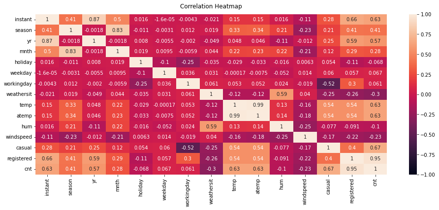
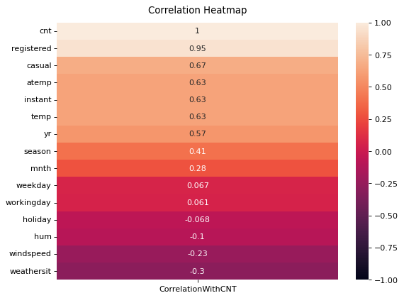
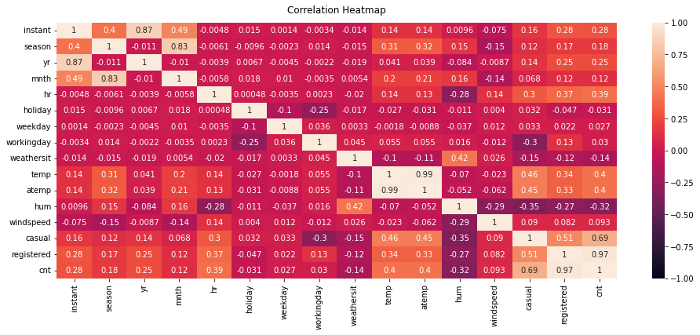
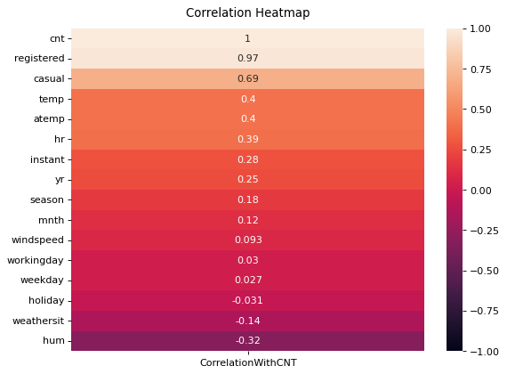
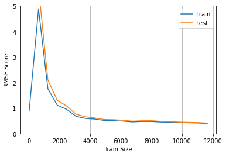
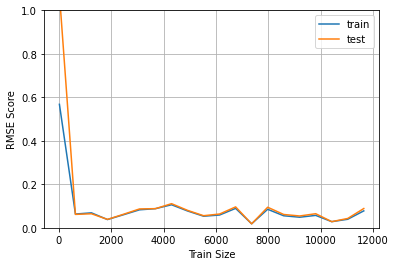

#  Linear Regression

## Required Libraries 


```python
import pandas as pd 
import numpy as np 
from matplotlib import pyplot as plt 
import seaborn as sns 

from sklearn import linear_model as lin
from sklearn import model_selection as mod
from sklearn import metrics as met
from sklearn import preprocessing as pre
from sklearn import pipeline as pip
```

## Data & Basic Details 


```python
df_day = pd.read_csv("data/day.csv")
df_hour = pd.read_csv("data/hour.csv")
```


```python
df_day.head()
```


<div>
<style scoped>
    .dataframe tbody tr th:only-of-type {
        vertical-align: middle;
    }

    .dataframe tbody tr th {
        vertical-align: top;
    }

    .dataframe thead th {
        text-align: right;
    }
</style>
<table border="1" class="dataframe">
  <thead>
    <tr style="text-align: right;">
      <th></th>
      <th>instant</th>
      <th>dteday</th>
      <th>season</th>
      <th>yr</th>
      <th>mnth</th>
      <th>holiday</th>
      <th>weekday</th>
      <th>workingday</th>
      <th>weathersit</th>
      <th>temp</th>
      <th>atemp</th>
      <th>hum</th>
      <th>windspeed</th>
      <th>casual</th>
      <th>registered</th>
      <th>cnt</th>
    </tr>
  </thead>
  <tbody>
    <tr>
      <th>0</th>
      <td>1</td>
      <td>2011-01-01</td>
      <td>1</td>
      <td>0</td>
      <td>1</td>
      <td>0</td>
      <td>6</td>
      <td>0</td>
      <td>2</td>
      <td>0.344167</td>
      <td>0.363625</td>
      <td>0.805833</td>
      <td>0.160446</td>
      <td>331</td>
      <td>654</td>
      <td>985</td>
    </tr>
    <tr>
      <th>1</th>
      <td>2</td>
      <td>2011-01-02</td>
      <td>1</td>
      <td>0</td>
      <td>1</td>
      <td>0</td>
      <td>0</td>
      <td>0</td>
      <td>2</td>
      <td>0.363478</td>
      <td>0.353739</td>
      <td>0.696087</td>
      <td>0.248539</td>
      <td>131</td>
      <td>670</td>
      <td>801</td>
    </tr>
    <tr>
      <th>2</th>
      <td>3</td>
      <td>2011-01-03</td>
      <td>1</td>
      <td>0</td>
      <td>1</td>
      <td>0</td>
      <td>1</td>
      <td>1</td>
      <td>1</td>
      <td>0.196364</td>
      <td>0.189405</td>
      <td>0.437273</td>
      <td>0.248309</td>
      <td>120</td>
      <td>1229</td>
      <td>1349</td>
    </tr>
    <tr>
      <th>3</th>
      <td>4</td>
      <td>2011-01-04</td>
      <td>1</td>
      <td>0</td>
      <td>1</td>
      <td>0</td>
      <td>2</td>
      <td>1</td>
      <td>1</td>
      <td>0.200000</td>
      <td>0.212122</td>
      <td>0.590435</td>
      <td>0.160296</td>
      <td>108</td>
      <td>1454</td>
      <td>1562</td>
    </tr>
    <tr>
      <th>4</th>
      <td>5</td>
      <td>2011-01-05</td>
      <td>1</td>
      <td>0</td>
      <td>1</td>
      <td>0</td>
      <td>3</td>
      <td>1</td>
      <td>1</td>
      <td>0.226957</td>
      <td>0.229270</td>
      <td>0.436957</td>
      <td>0.186900</td>
      <td>82</td>
      <td>1518</td>
      <td>1600</td>
    </tr>
  </tbody>
</table>
</div>


```python
df_hour.head(60)
```


<div>
<style scoped>
    .dataframe tbody tr th:only-of-type {
        vertical-align: middle;
    }

    .dataframe tbody tr th {
        vertical-align: top;
    }

    .dataframe thead th {
        text-align: right;
    }
</style>
<table border="1" class="dataframe">
  <thead>
    <tr style="text-align: right;">
      <th></th>
      <th>instant</th>
      <th>dteday</th>
      <th>season</th>
      <th>yr</th>
      <th>mnth</th>
      <th>hr</th>
      <th>holiday</th>
      <th>weekday</th>
      <th>workingday</th>
      <th>weathersit</th>
      <th>temp</th>
      <th>atemp</th>
      <th>hum</th>
      <th>windspeed</th>
      <th>casual</th>
      <th>registered</th>
      <th>cnt</th>
    </tr>
  </thead>
  <tbody>
    <tr>
      <th>0</th>
      <td>1</td>
      <td>2011-01-01</td>
      <td>1</td>
      <td>0</td>
      <td>1</td>
      <td>0</td>
      <td>0</td>
      <td>6</td>
      <td>0</td>
      <td>1</td>
      <td>0.24</td>
      <td>0.2879</td>
      <td>0.81</td>
      <td>0.0000</td>
      <td>3</td>
      <td>13</td>
      <td>16</td>
    </tr>
    <tr>
      <th>1</th>
      <td>2</td>
      <td>2011-01-01</td>
      <td>1</td>
      <td>0</td>
      <td>1</td>
      <td>1</td>
      <td>0</td>
      <td>6</td>
      <td>0</td>
      <td>1</td>
      <td>0.22</td>
      <td>0.2727</td>
      <td>0.80</td>
      <td>0.0000</td>
      <td>8</td>
      <td>32</td>
      <td>40</td>
    </tr>
    <tr>
      <th>2</th>
      <td>3</td>
      <td>2011-01-01</td>
      <td>1</td>
      <td>0</td>
      <td>1</td>
      <td>2</td>
      <td>0</td>
      <td>6</td>
      <td>0</td>
      <td>1</td>
      <td>0.22</td>
      <td>0.2727</td>
      <td>0.80</td>
      <td>0.0000</td>
      <td>5</td>
      <td>27</td>
      <td>32</td>
    </tr>
    <tr>
      <th>3</th>
      <td>4</td>
      <td>2011-01-01</td>
      <td>1</td>
      <td>0</td>
      <td>1</td>
      <td>3</td>
      <td>0</td>
      <td>6</td>
      <td>0</td>
      <td>1</td>
      <td>0.24</td>
      <td>0.2879</td>
      <td>0.75</td>
      <td>0.0000</td>
      <td>3</td>
      <td>10</td>
      <td>13</td>
    </tr>
    <tr>
      <th>4</th>
      <td>5</td>
      <td>2011-01-01</td>
      <td>1</td>
      <td>0</td>
      <td>1</td>
      <td>4</td>
      <td>0</td>
      <td>6</td>
      <td>0</td>
      <td>1</td>
      <td>0.24</td>
      <td>0.2879</td>
      <td>0.75</td>
      <td>0.0000</td>
      <td>0</td>
      <td>1</td>
      <td>1</td>
    </tr>
    <tr>
      <th>5</th>
      <td>6</td>
      <td>2011-01-01</td>
      <td>1</td>
      <td>0</td>
      <td>1</td>
      <td>5</td>
      <td>0</td>
      <td>6</td>
      <td>0</td>
      <td>2</td>
      <td>0.24</td>
      <td>0.2576</td>
      <td>0.75</td>
      <td>0.0896</td>
      <td>0</td>
      <td>1</td>
      <td>1</td>
    </tr>
    <tr>
      <th>6</th>
      <td>7</td>
      <td>2011-01-01</td>
      <td>1</td>
      <td>0</td>
      <td>1</td>
      <td>6</td>
      <td>0</td>
      <td>6</td>
      <td>0</td>
      <td>1</td>
      <td>0.22</td>
      <td>0.2727</td>
      <td>0.80</td>
      <td>0.0000</td>
      <td>2</td>
      <td>0</td>
      <td>2</td>
    </tr>
    <tr>
      <th>7</th>
      <td>8</td>
      <td>2011-01-01</td>
      <td>1</td>
      <td>0</td>
      <td>1</td>
      <td>7</td>
      <td>0</td>
      <td>6</td>
      <td>0</td>
      <td>1</td>
      <td>0.20</td>
      <td>0.2576</td>
      <td>0.86</td>
      <td>0.0000</td>
      <td>1</td>
      <td>2</td>
      <td>3</td>
    </tr>
    <tr>
      <th>8</th>
      <td>9</td>
      <td>2011-01-01</td>
      <td>1</td>
      <td>0</td>
      <td>1</td>
      <td>8</td>
      <td>0</td>
      <td>6</td>
      <td>0</td>
      <td>1</td>
      <td>0.24</td>
      <td>0.2879</td>
      <td>0.75</td>
      <td>0.0000</td>
      <td>1</td>
      <td>7</td>
      <td>8</td>
    </tr>
    <tr>
      <th>9</th>
      <td>10</td>
      <td>2011-01-01</td>
      <td>1</td>
      <td>0</td>
      <td>1</td>
      <td>9</td>
      <td>0</td>
      <td>6</td>
      <td>0</td>
      <td>1</td>
      <td>0.32</td>
      <td>0.3485</td>
      <td>0.76</td>
      <td>0.0000</td>
      <td>8</td>
      <td>6</td>
      <td>14</td>
    </tr>
    <tr>
      <th>10</th>
      <td>11</td>
      <td>2011-01-01</td>
      <td>1</td>
      <td>0</td>
      <td>1</td>
      <td>10</td>
      <td>0</td>
      <td>6</td>
      <td>0</td>
      <td>1</td>
      <td>0.38</td>
      <td>0.3939</td>
      <td>0.76</td>
      <td>0.2537</td>
      <td>12</td>
      <td>24</td>
      <td>36</td>
    </tr>
    <tr>
      <th>11</th>
      <td>12</td>
      <td>2011-01-01</td>
      <td>1</td>
      <td>0</td>
      <td>1</td>
      <td>11</td>
      <td>0</td>
      <td>6</td>
      <td>0</td>
      <td>1</td>
      <td>0.36</td>
      <td>0.3333</td>
      <td>0.81</td>
      <td>0.2836</td>
      <td>26</td>
      <td>30</td>
      <td>56</td>
    </tr>
    <tr>
      <th>12</th>
      <td>13</td>
      <td>2011-01-01</td>
      <td>1</td>
      <td>0</td>
      <td>1</td>
      <td>12</td>
      <td>0</td>
      <td>6</td>
      <td>0</td>
      <td>1</td>
      <td>0.42</td>
      <td>0.4242</td>
      <td>0.77</td>
      <td>0.2836</td>
      <td>29</td>
      <td>55</td>
      <td>84</td>
    </tr>
    <tr>
      <th>13</th>
      <td>14</td>
      <td>2011-01-01</td>
      <td>1</td>
      <td>0</td>
      <td>1</td>
      <td>13</td>
      <td>0</td>
      <td>6</td>
      <td>0</td>
      <td>2</td>
      <td>0.46</td>
      <td>0.4545</td>
      <td>0.72</td>
      <td>0.2985</td>
      <td>47</td>
      <td>47</td>
      <td>94</td>
    </tr>
    <tr>
      <th>14</th>
      <td>15</td>
      <td>2011-01-01</td>
      <td>1</td>
      <td>0</td>
      <td>1</td>
      <td>14</td>
      <td>0</td>
      <td>6</td>
      <td>0</td>
      <td>2</td>
      <td>0.46</td>
      <td>0.4545</td>
      <td>0.72</td>
      <td>0.2836</td>
      <td>35</td>
      <td>71</td>
      <td>106</td>
    </tr>
    <tr>
      <th>15</th>
      <td>16</td>
      <td>2011-01-01</td>
      <td>1</td>
      <td>0</td>
      <td>1</td>
      <td>15</td>
      <td>0</td>
      <td>6</td>
      <td>0</td>
      <td>2</td>
      <td>0.44</td>
      <td>0.4394</td>
      <td>0.77</td>
      <td>0.2985</td>
      <td>40</td>
      <td>70</td>
      <td>110</td>
    </tr>
    <tr>
      <th>16</th>
      <td>17</td>
      <td>2011-01-01</td>
      <td>1</td>
      <td>0</td>
      <td>1</td>
      <td>16</td>
      <td>0</td>
      <td>6</td>
      <td>0</td>
      <td>2</td>
      <td>0.42</td>
      <td>0.4242</td>
      <td>0.82</td>
      <td>0.2985</td>
      <td>41</td>
      <td>52</td>
      <td>93</td>
    </tr>
    <tr>
      <th>17</th>
      <td>18</td>
      <td>2011-01-01</td>
      <td>1</td>
      <td>0</td>
      <td>1</td>
      <td>17</td>
      <td>0</td>
      <td>6</td>
      <td>0</td>
      <td>2</td>
      <td>0.44</td>
      <td>0.4394</td>
      <td>0.82</td>
      <td>0.2836</td>
      <td>15</td>
      <td>52</td>
      <td>67</td>
    </tr>
    <tr>
      <th>18</th>
      <td>19</td>
      <td>2011-01-01</td>
      <td>1</td>
      <td>0</td>
      <td>1</td>
      <td>18</td>
      <td>0</td>
      <td>6</td>
      <td>0</td>
      <td>3</td>
      <td>0.42</td>
      <td>0.4242</td>
      <td>0.88</td>
      <td>0.2537</td>
      <td>9</td>
      <td>26</td>
      <td>35</td>
    </tr>
    <tr>
      <th>19</th>
      <td>20</td>
      <td>2011-01-01</td>
      <td>1</td>
      <td>0</td>
      <td>1</td>
      <td>19</td>
      <td>0</td>
      <td>6</td>
      <td>0</td>
      <td>3</td>
      <td>0.42</td>
      <td>0.4242</td>
      <td>0.88</td>
      <td>0.2537</td>
      <td>6</td>
      <td>31</td>
      <td>37</td>
    </tr>
    <tr>
      <th>20</th>
      <td>21</td>
      <td>2011-01-01</td>
      <td>1</td>
      <td>0</td>
      <td>1</td>
      <td>20</td>
      <td>0</td>
      <td>6</td>
      <td>0</td>
      <td>2</td>
      <td>0.40</td>
      <td>0.4091</td>
      <td>0.87</td>
      <td>0.2537</td>
      <td>11</td>
      <td>25</td>
      <td>36</td>
    </tr>
    <tr>
      <th>21</th>
      <td>22</td>
      <td>2011-01-01</td>
      <td>1</td>
      <td>0</td>
      <td>1</td>
      <td>21</td>
      <td>0</td>
      <td>6</td>
      <td>0</td>
      <td>2</td>
      <td>0.40</td>
      <td>0.4091</td>
      <td>0.87</td>
      <td>0.1940</td>
      <td>3</td>
      <td>31</td>
      <td>34</td>
    </tr>
    <tr>
      <th>22</th>
      <td>23</td>
      <td>2011-01-01</td>
      <td>1</td>
      <td>0</td>
      <td>1</td>
      <td>22</td>
      <td>0</td>
      <td>6</td>
      <td>0</td>
      <td>2</td>
      <td>0.40</td>
      <td>0.4091</td>
      <td>0.94</td>
      <td>0.2239</td>
      <td>11</td>
      <td>17</td>
      <td>28</td>
    </tr>
    <tr>
      <th>23</th>
      <td>24</td>
      <td>2011-01-01</td>
      <td>1</td>
      <td>0</td>
      <td>1</td>
      <td>23</td>
      <td>0</td>
      <td>6</td>
      <td>0</td>
      <td>2</td>
      <td>0.46</td>
      <td>0.4545</td>
      <td>0.88</td>
      <td>0.2985</td>
      <td>15</td>
      <td>24</td>
      <td>39</td>
    </tr>
    <tr>
      <th>24</th>
      <td>25</td>
      <td>2011-01-02</td>
      <td>1</td>
      <td>0</td>
      <td>1</td>
      <td>0</td>
      <td>0</td>
      <td>0</td>
      <td>0</td>
      <td>2</td>
      <td>0.46</td>
      <td>0.4545</td>
      <td>0.88</td>
      <td>0.2985</td>
      <td>4</td>
      <td>13</td>
      <td>17</td>
    </tr>
    <tr>
      <th>25</th>
      <td>26</td>
      <td>2011-01-02</td>
      <td>1</td>
      <td>0</td>
      <td>1</td>
      <td>1</td>
      <td>0</td>
      <td>0</td>
      <td>0</td>
      <td>2</td>
      <td>0.44</td>
      <td>0.4394</td>
      <td>0.94</td>
      <td>0.2537</td>
      <td>1</td>
      <td>16</td>
      <td>17</td>
    </tr>
    <tr>
      <th>26</th>
      <td>27</td>
      <td>2011-01-02</td>
      <td>1</td>
      <td>0</td>
      <td>1</td>
      <td>2</td>
      <td>0</td>
      <td>0</td>
      <td>0</td>
      <td>2</td>
      <td>0.42</td>
      <td>0.4242</td>
      <td>1.00</td>
      <td>0.2836</td>
      <td>1</td>
      <td>8</td>
      <td>9</td>
    </tr>
    <tr>
      <th>27</th>
      <td>28</td>
      <td>2011-01-02</td>
      <td>1</td>
      <td>0</td>
      <td>1</td>
      <td>3</td>
      <td>0</td>
      <td>0</td>
      <td>0</td>
      <td>2</td>
      <td>0.46</td>
      <td>0.4545</td>
      <td>0.94</td>
      <td>0.1940</td>
      <td>2</td>
      <td>4</td>
      <td>6</td>
    </tr>
    <tr>
      <th>28</th>
      <td>29</td>
      <td>2011-01-02</td>
      <td>1</td>
      <td>0</td>
      <td>1</td>
      <td>4</td>
      <td>0</td>
      <td>0</td>
      <td>0</td>
      <td>2</td>
      <td>0.46</td>
      <td>0.4545</td>
      <td>0.94</td>
      <td>0.1940</td>
      <td>2</td>
      <td>1</td>
      <td>3</td>
    </tr>
    <tr>
      <th>29</th>
      <td>30</td>
      <td>2011-01-02</td>
      <td>1</td>
      <td>0</td>
      <td>1</td>
      <td>6</td>
      <td>0</td>
      <td>0</td>
      <td>0</td>
      <td>3</td>
      <td>0.42</td>
      <td>0.4242</td>
      <td>0.77</td>
      <td>0.2985</td>
      <td>0</td>
      <td>2</td>
      <td>2</td>
    </tr>
    <tr>
      <th>30</th>
      <td>31</td>
      <td>2011-01-02</td>
      <td>1</td>
      <td>0</td>
      <td>1</td>
      <td>7</td>
      <td>0</td>
      <td>0</td>
      <td>0</td>
      <td>2</td>
      <td>0.40</td>
      <td>0.4091</td>
      <td>0.76</td>
      <td>0.1940</td>
      <td>0</td>
      <td>1</td>
      <td>1</td>
    </tr>
    <tr>
      <th>31</th>
      <td>32</td>
      <td>2011-01-02</td>
      <td>1</td>
      <td>0</td>
      <td>1</td>
      <td>8</td>
      <td>0</td>
      <td>0</td>
      <td>0</td>
      <td>3</td>
      <td>0.40</td>
      <td>0.4091</td>
      <td>0.71</td>
      <td>0.2239</td>
      <td>0</td>
      <td>8</td>
      <td>8</td>
    </tr>
    <tr>
      <th>32</th>
      <td>33</td>
      <td>2011-01-02</td>
      <td>1</td>
      <td>0</td>
      <td>1</td>
      <td>9</td>
      <td>0</td>
      <td>0</td>
      <td>0</td>
      <td>2</td>
      <td>0.38</td>
      <td>0.3939</td>
      <td>0.76</td>
      <td>0.2239</td>
      <td>1</td>
      <td>19</td>
      <td>20</td>
    </tr>
    <tr>
      <th>33</th>
      <td>34</td>
      <td>2011-01-02</td>
      <td>1</td>
      <td>0</td>
      <td>1</td>
      <td>10</td>
      <td>0</td>
      <td>0</td>
      <td>0</td>
      <td>2</td>
      <td>0.36</td>
      <td>0.3485</td>
      <td>0.81</td>
      <td>0.2239</td>
      <td>7</td>
      <td>46</td>
      <td>53</td>
    </tr>
    <tr>
      <th>34</th>
      <td>35</td>
      <td>2011-01-02</td>
      <td>1</td>
      <td>0</td>
      <td>1</td>
      <td>11</td>
      <td>0</td>
      <td>0</td>
      <td>0</td>
      <td>2</td>
      <td>0.36</td>
      <td>0.3333</td>
      <td>0.71</td>
      <td>0.2537</td>
      <td>16</td>
      <td>54</td>
      <td>70</td>
    </tr>
    <tr>
      <th>35</th>
      <td>36</td>
      <td>2011-01-02</td>
      <td>1</td>
      <td>0</td>
      <td>1</td>
      <td>12</td>
      <td>0</td>
      <td>0</td>
      <td>0</td>
      <td>2</td>
      <td>0.36</td>
      <td>0.3333</td>
      <td>0.66</td>
      <td>0.2985</td>
      <td>20</td>
      <td>73</td>
      <td>93</td>
    </tr>
    <tr>
      <th>36</th>
      <td>37</td>
      <td>2011-01-02</td>
      <td>1</td>
      <td>0</td>
      <td>1</td>
      <td>13</td>
      <td>0</td>
      <td>0</td>
      <td>0</td>
      <td>2</td>
      <td>0.36</td>
      <td>0.3485</td>
      <td>0.66</td>
      <td>0.1343</td>
      <td>11</td>
      <td>64</td>
      <td>75</td>
    </tr>
    <tr>
      <th>37</th>
      <td>38</td>
      <td>2011-01-02</td>
      <td>1</td>
      <td>0</td>
      <td>1</td>
      <td>14</td>
      <td>0</td>
      <td>0</td>
      <td>0</td>
      <td>3</td>
      <td>0.36</td>
      <td>0.3485</td>
      <td>0.76</td>
      <td>0.1940</td>
      <td>4</td>
      <td>55</td>
      <td>59</td>
    </tr>
    <tr>
      <th>38</th>
      <td>39</td>
      <td>2011-01-02</td>
      <td>1</td>
      <td>0</td>
      <td>1</td>
      <td>15</td>
      <td>0</td>
      <td>0</td>
      <td>0</td>
      <td>3</td>
      <td>0.34</td>
      <td>0.3333</td>
      <td>0.81</td>
      <td>0.1642</td>
      <td>19</td>
      <td>55</td>
      <td>74</td>
    </tr>
    <tr>
      <th>39</th>
      <td>40</td>
      <td>2011-01-02</td>
      <td>1</td>
      <td>0</td>
      <td>1</td>
      <td>16</td>
      <td>0</td>
      <td>0</td>
      <td>0</td>
      <td>3</td>
      <td>0.34</td>
      <td>0.3333</td>
      <td>0.71</td>
      <td>0.1642</td>
      <td>9</td>
      <td>67</td>
      <td>76</td>
    </tr>
    <tr>
      <th>40</th>
      <td>41</td>
      <td>2011-01-02</td>
      <td>1</td>
      <td>0</td>
      <td>1</td>
      <td>17</td>
      <td>0</td>
      <td>0</td>
      <td>0</td>
      <td>1</td>
      <td>0.34</td>
      <td>0.3333</td>
      <td>0.57</td>
      <td>0.1940</td>
      <td>7</td>
      <td>58</td>
      <td>65</td>
    </tr>
    <tr>
      <th>41</th>
      <td>42</td>
      <td>2011-01-02</td>
      <td>1</td>
      <td>0</td>
      <td>1</td>
      <td>18</td>
      <td>0</td>
      <td>0</td>
      <td>0</td>
      <td>2</td>
      <td>0.36</td>
      <td>0.3333</td>
      <td>0.46</td>
      <td>0.3284</td>
      <td>10</td>
      <td>43</td>
      <td>53</td>
    </tr>
    <tr>
      <th>42</th>
      <td>43</td>
      <td>2011-01-02</td>
      <td>1</td>
      <td>0</td>
      <td>1</td>
      <td>19</td>
      <td>0</td>
      <td>0</td>
      <td>0</td>
      <td>1</td>
      <td>0.32</td>
      <td>0.2879</td>
      <td>0.42</td>
      <td>0.4478</td>
      <td>1</td>
      <td>29</td>
      <td>30</td>
    </tr>
    <tr>
      <th>43</th>
      <td>44</td>
      <td>2011-01-02</td>
      <td>1</td>
      <td>0</td>
      <td>1</td>
      <td>20</td>
      <td>0</td>
      <td>0</td>
      <td>0</td>
      <td>1</td>
      <td>0.30</td>
      <td>0.2727</td>
      <td>0.39</td>
      <td>0.3582</td>
      <td>5</td>
      <td>17</td>
      <td>22</td>
    </tr>
    <tr>
      <th>44</th>
      <td>45</td>
      <td>2011-01-02</td>
      <td>1</td>
      <td>0</td>
      <td>1</td>
      <td>21</td>
      <td>0</td>
      <td>0</td>
      <td>0</td>
      <td>1</td>
      <td>0.26</td>
      <td>0.2273</td>
      <td>0.44</td>
      <td>0.3284</td>
      <td>11</td>
      <td>20</td>
      <td>31</td>
    </tr>
    <tr>
      <th>45</th>
      <td>46</td>
      <td>2011-01-02</td>
      <td>1</td>
      <td>0</td>
      <td>1</td>
      <td>22</td>
      <td>0</td>
      <td>0</td>
      <td>0</td>
      <td>1</td>
      <td>0.24</td>
      <td>0.2121</td>
      <td>0.44</td>
      <td>0.2985</td>
      <td>0</td>
      <td>9</td>
      <td>9</td>
    </tr>
    <tr>
      <th>46</th>
      <td>47</td>
      <td>2011-01-02</td>
      <td>1</td>
      <td>0</td>
      <td>1</td>
      <td>23</td>
      <td>0</td>
      <td>0</td>
      <td>0</td>
      <td>1</td>
      <td>0.22</td>
      <td>0.2273</td>
      <td>0.47</td>
      <td>0.1642</td>
      <td>0</td>
      <td>8</td>
      <td>8</td>
    </tr>
    <tr>
      <th>47</th>
      <td>48</td>
      <td>2011-01-03</td>
      <td>1</td>
      <td>0</td>
      <td>1</td>
      <td>0</td>
      <td>0</td>
      <td>1</td>
      <td>1</td>
      <td>1</td>
      <td>0.22</td>
      <td>0.1970</td>
      <td>0.44</td>
      <td>0.3582</td>
      <td>0</td>
      <td>5</td>
      <td>5</td>
    </tr>
    <tr>
      <th>48</th>
      <td>49</td>
      <td>2011-01-03</td>
      <td>1</td>
      <td>0</td>
      <td>1</td>
      <td>1</td>
      <td>0</td>
      <td>1</td>
      <td>1</td>
      <td>1</td>
      <td>0.20</td>
      <td>0.1667</td>
      <td>0.44</td>
      <td>0.4179</td>
      <td>0</td>
      <td>2</td>
      <td>2</td>
    </tr>
    <tr>
      <th>49</th>
      <td>50</td>
      <td>2011-01-03</td>
      <td>1</td>
      <td>0</td>
      <td>1</td>
      <td>4</td>
      <td>0</td>
      <td>1</td>
      <td>1</td>
      <td>1</td>
      <td>0.16</td>
      <td>0.1364</td>
      <td>0.47</td>
      <td>0.3881</td>
      <td>0</td>
      <td>1</td>
      <td>1</td>
    </tr>
    <tr>
      <th>50</th>
      <td>51</td>
      <td>2011-01-03</td>
      <td>1</td>
      <td>0</td>
      <td>1</td>
      <td>5</td>
      <td>0</td>
      <td>1</td>
      <td>1</td>
      <td>1</td>
      <td>0.16</td>
      <td>0.1364</td>
      <td>0.47</td>
      <td>0.2836</td>
      <td>0</td>
      <td>3</td>
      <td>3</td>
    </tr>
    <tr>
      <th>51</th>
      <td>52</td>
      <td>2011-01-03</td>
      <td>1</td>
      <td>0</td>
      <td>1</td>
      <td>6</td>
      <td>0</td>
      <td>1</td>
      <td>1</td>
      <td>1</td>
      <td>0.14</td>
      <td>0.1061</td>
      <td>0.50</td>
      <td>0.3881</td>
      <td>0</td>
      <td>30</td>
      <td>30</td>
    </tr>
    <tr>
      <th>52</th>
      <td>53</td>
      <td>2011-01-03</td>
      <td>1</td>
      <td>0</td>
      <td>1</td>
      <td>7</td>
      <td>0</td>
      <td>1</td>
      <td>1</td>
      <td>1</td>
      <td>0.14</td>
      <td>0.1364</td>
      <td>0.50</td>
      <td>0.1940</td>
      <td>1</td>
      <td>63</td>
      <td>64</td>
    </tr>
    <tr>
      <th>53</th>
      <td>54</td>
      <td>2011-01-03</td>
      <td>1</td>
      <td>0</td>
      <td>1</td>
      <td>8</td>
      <td>0</td>
      <td>1</td>
      <td>1</td>
      <td>1</td>
      <td>0.14</td>
      <td>0.1212</td>
      <td>0.50</td>
      <td>0.2836</td>
      <td>1</td>
      <td>153</td>
      <td>154</td>
    </tr>
    <tr>
      <th>54</th>
      <td>55</td>
      <td>2011-01-03</td>
      <td>1</td>
      <td>0</td>
      <td>1</td>
      <td>9</td>
      <td>0</td>
      <td>1</td>
      <td>1</td>
      <td>1</td>
      <td>0.16</td>
      <td>0.1364</td>
      <td>0.43</td>
      <td>0.3881</td>
      <td>7</td>
      <td>81</td>
      <td>88</td>
    </tr>
    <tr>
      <th>55</th>
      <td>56</td>
      <td>2011-01-03</td>
      <td>1</td>
      <td>0</td>
      <td>1</td>
      <td>10</td>
      <td>0</td>
      <td>1</td>
      <td>1</td>
      <td>1</td>
      <td>0.18</td>
      <td>0.1667</td>
      <td>0.43</td>
      <td>0.2537</td>
      <td>11</td>
      <td>33</td>
      <td>44</td>
    </tr>
    <tr>
      <th>56</th>
      <td>57</td>
      <td>2011-01-03</td>
      <td>1</td>
      <td>0</td>
      <td>1</td>
      <td>11</td>
      <td>0</td>
      <td>1</td>
      <td>1</td>
      <td>1</td>
      <td>0.20</td>
      <td>0.1818</td>
      <td>0.40</td>
      <td>0.3284</td>
      <td>10</td>
      <td>41</td>
      <td>51</td>
    </tr>
    <tr>
      <th>57</th>
      <td>58</td>
      <td>2011-01-03</td>
      <td>1</td>
      <td>0</td>
      <td>1</td>
      <td>12</td>
      <td>0</td>
      <td>1</td>
      <td>1</td>
      <td>1</td>
      <td>0.22</td>
      <td>0.2121</td>
      <td>0.35</td>
      <td>0.2985</td>
      <td>13</td>
      <td>48</td>
      <td>61</td>
    </tr>
    <tr>
      <th>58</th>
      <td>59</td>
      <td>2011-01-03</td>
      <td>1</td>
      <td>0</td>
      <td>1</td>
      <td>13</td>
      <td>0</td>
      <td>1</td>
      <td>1</td>
      <td>1</td>
      <td>0.24</td>
      <td>0.2121</td>
      <td>0.35</td>
      <td>0.2836</td>
      <td>8</td>
      <td>53</td>
      <td>61</td>
    </tr>
    <tr>
      <th>59</th>
      <td>60</td>
      <td>2011-01-03</td>
      <td>1</td>
      <td>0</td>
      <td>1</td>
      <td>14</td>
      <td>0</td>
      <td>1</td>
      <td>1</td>
      <td>1</td>
      <td>0.26</td>
      <td>0.2424</td>
      <td>0.30</td>
      <td>0.2836</td>
      <td>11</td>
      <td>66</td>
      <td>77</td>
    </tr>
  </tbody>
</table>
</div>


```python
print(df_day.info())
```

    <class 'pandas.core.frame.DataFrame'>
    RangeIndex: 731 entries, 0 to 730
    Data columns (total 16 columns):
     #   Column      Non-Null Count  Dtype  
    ---  ------      --------------  -----  
     0   instant     731 non-null    int64  
     1   dteday      731 non-null    object 
     2   season      731 non-null    int64  
     3   yr          731 non-null    int64  
     4   mnth        731 non-null    int64  
     5   holiday     731 non-null    int64  
     6   weekday     731 non-null    int64  
     7   workingday  731 non-null    int64  
     8   weathersit  731 non-null    int64  
     9   temp        731 non-null    float64
     10  atemp       731 non-null    float64
     11  hum         731 non-null    float64
     12  windspeed   731 non-null    float64
     13  casual      731 non-null    int64  
     14  registered  731 non-null    int64  
     15  cnt         731 non-null    int64  
    dtypes: float64(4), int64(11), object(1)
    memory usage: 91.5+ KB
    None
    


```python
df_day.describe()
```


<div>
<style scoped>
    .dataframe tbody tr th:only-of-type {
        vertical-align: middle;
    }

    .dataframe tbody tr th {
        vertical-align: top;
    }

    .dataframe thead th {
        text-align: right;
    }
</style>
<table border="1" class="dataframe">
  <thead>
    <tr style="text-align: right;">
      <th></th>
      <th>instant</th>
      <th>season</th>
      <th>yr</th>
      <th>mnth</th>
      <th>holiday</th>
      <th>weekday</th>
      <th>workingday</th>
      <th>weathersit</th>
      <th>temp</th>
      <th>atemp</th>
      <th>hum</th>
      <th>windspeed</th>
      <th>casual</th>
      <th>registered</th>
      <th>cnt</th>
    </tr>
  </thead>
  <tbody>
    <tr>
      <th>count</th>
      <td>731.000000</td>
      <td>731.000000</td>
      <td>731.000000</td>
      <td>731.000000</td>
      <td>731.000000</td>
      <td>731.000000</td>
      <td>731.000000</td>
      <td>731.000000</td>
      <td>731.000000</td>
      <td>731.000000</td>
      <td>731.000000</td>
      <td>731.000000</td>
      <td>731.000000</td>
      <td>731.000000</td>
      <td>731.000000</td>
    </tr>
    <tr>
      <th>mean</th>
      <td>366.000000</td>
      <td>2.496580</td>
      <td>0.500684</td>
      <td>6.519836</td>
      <td>0.028728</td>
      <td>2.997264</td>
      <td>0.683995</td>
      <td>1.395349</td>
      <td>0.495385</td>
      <td>0.474354</td>
      <td>0.627894</td>
      <td>0.190486</td>
      <td>848.176471</td>
      <td>3656.172367</td>
      <td>4504.348837</td>
    </tr>
    <tr>
      <th>std</th>
      <td>211.165812</td>
      <td>1.110807</td>
      <td>0.500342</td>
      <td>3.451913</td>
      <td>0.167155</td>
      <td>2.004787</td>
      <td>0.465233</td>
      <td>0.544894</td>
      <td>0.183051</td>
      <td>0.162961</td>
      <td>0.142429</td>
      <td>0.077498</td>
      <td>686.622488</td>
      <td>1560.256377</td>
      <td>1937.211452</td>
    </tr>
    <tr>
      <th>min</th>
      <td>1.000000</td>
      <td>1.000000</td>
      <td>0.000000</td>
      <td>1.000000</td>
      <td>0.000000</td>
      <td>0.000000</td>
      <td>0.000000</td>
      <td>1.000000</td>
      <td>0.059130</td>
      <td>0.079070</td>
      <td>0.000000</td>
      <td>0.022392</td>
      <td>2.000000</td>
      <td>20.000000</td>
      <td>22.000000</td>
    </tr>
    <tr>
      <th>25%</th>
      <td>183.500000</td>
      <td>2.000000</td>
      <td>0.000000</td>
      <td>4.000000</td>
      <td>0.000000</td>
      <td>1.000000</td>
      <td>0.000000</td>
      <td>1.000000</td>
      <td>0.337083</td>
      <td>0.337842</td>
      <td>0.520000</td>
      <td>0.134950</td>
      <td>315.500000</td>
      <td>2497.000000</td>
      <td>3152.000000</td>
    </tr>
    <tr>
      <th>50%</th>
      <td>366.000000</td>
      <td>3.000000</td>
      <td>1.000000</td>
      <td>7.000000</td>
      <td>0.000000</td>
      <td>3.000000</td>
      <td>1.000000</td>
      <td>1.000000</td>
      <td>0.498333</td>
      <td>0.486733</td>
      <td>0.626667</td>
      <td>0.180975</td>
      <td>713.000000</td>
      <td>3662.000000</td>
      <td>4548.000000</td>
    </tr>
    <tr>
      <th>75%</th>
      <td>548.500000</td>
      <td>3.000000</td>
      <td>1.000000</td>
      <td>10.000000</td>
      <td>0.000000</td>
      <td>5.000000</td>
      <td>1.000000</td>
      <td>2.000000</td>
      <td>0.655417</td>
      <td>0.608602</td>
      <td>0.730209</td>
      <td>0.233214</td>
      <td>1096.000000</td>
      <td>4776.500000</td>
      <td>5956.000000</td>
    </tr>
    <tr>
      <th>max</th>
      <td>731.000000</td>
      <td>4.000000</td>
      <td>1.000000</td>
      <td>12.000000</td>
      <td>1.000000</td>
      <td>6.000000</td>
      <td>1.000000</td>
      <td>3.000000</td>
      <td>0.861667</td>
      <td>0.840896</td>
      <td>0.972500</td>
      <td>0.507463</td>
      <td>3410.000000</td>
      <td>6946.000000</td>
      <td>8714.000000</td>
    </tr>
  </tbody>
</table>
</div>


```python
df_hour.info()
```

    <class 'pandas.core.frame.DataFrame'>
    RangeIndex: 17379 entries, 0 to 17378
    Data columns (total 17 columns):
     #   Column      Non-Null Count  Dtype  
    ---  ------      --------------  -----  
     0   instant     17379 non-null  int64  
     1   dteday      17379 non-null  object 
     2   season      17379 non-null  int64  
     3   yr          17379 non-null  int64  
     4   mnth        17379 non-null  int64  
     5   hr          17379 non-null  int64  
     6   holiday     17379 non-null  int64  
     7   weekday     17379 non-null  int64  
     8   workingday  17379 non-null  int64  
     9   weathersit  17379 non-null  int64  
     10  temp        17379 non-null  float64
     11  atemp       17379 non-null  float64
     12  hum         17379 non-null  float64
     13  windspeed   17379 non-null  float64
     14  casual      17379 non-null  int64  
     15  registered  17379 non-null  int64  
     16  cnt         17379 non-null  int64  
    dtypes: float64(4), int64(12), object(1)
    memory usage: 2.3+ MB
    


```python
df_hour.describe()
```


<div>
<style scoped>
    .dataframe tbody tr th:only-of-type {
        vertical-align: middle;
    }

    .dataframe tbody tr th {
        vertical-align: top;
    }

    .dataframe thead th {
        text-align: right;
    }
</style>
<table border="1" class="dataframe">
  <thead>
    <tr style="text-align: right;">
      <th></th>
      <th>instant</th>
      <th>season</th>
      <th>yr</th>
      <th>mnth</th>
      <th>hr</th>
      <th>holiday</th>
      <th>weekday</th>
      <th>workingday</th>
      <th>weathersit</th>
      <th>temp</th>
      <th>atemp</th>
      <th>hum</th>
      <th>windspeed</th>
      <th>casual</th>
      <th>registered</th>
      <th>cnt</th>
    </tr>
  </thead>
  <tbody>
    <tr>
      <th>count</th>
      <td>17379.0000</td>
      <td>17379.000000</td>
      <td>17379.000000</td>
      <td>17379.000000</td>
      <td>17379.000000</td>
      <td>17379.000000</td>
      <td>17379.000000</td>
      <td>17379.000000</td>
      <td>17379.000000</td>
      <td>17379.000000</td>
      <td>17379.000000</td>
      <td>17379.000000</td>
      <td>17379.000000</td>
      <td>17379.000000</td>
      <td>17379.000000</td>
      <td>17379.000000</td>
    </tr>
    <tr>
      <th>mean</th>
      <td>8690.0000</td>
      <td>2.501640</td>
      <td>0.502561</td>
      <td>6.537775</td>
      <td>11.546752</td>
      <td>0.028770</td>
      <td>3.003683</td>
      <td>0.682721</td>
      <td>1.425283</td>
      <td>0.496987</td>
      <td>0.475775</td>
      <td>0.627229</td>
      <td>0.190098</td>
      <td>35.676218</td>
      <td>153.786869</td>
      <td>189.463088</td>
    </tr>
    <tr>
      <th>std</th>
      <td>5017.0295</td>
      <td>1.106918</td>
      <td>0.500008</td>
      <td>3.438776</td>
      <td>6.914405</td>
      <td>0.167165</td>
      <td>2.005771</td>
      <td>0.465431</td>
      <td>0.639357</td>
      <td>0.192556</td>
      <td>0.171850</td>
      <td>0.192930</td>
      <td>0.122340</td>
      <td>49.305030</td>
      <td>151.357286</td>
      <td>181.387599</td>
    </tr>
    <tr>
      <th>min</th>
      <td>1.0000</td>
      <td>1.000000</td>
      <td>0.000000</td>
      <td>1.000000</td>
      <td>0.000000</td>
      <td>0.000000</td>
      <td>0.000000</td>
      <td>0.000000</td>
      <td>1.000000</td>
      <td>0.020000</td>
      <td>0.000000</td>
      <td>0.000000</td>
      <td>0.000000</td>
      <td>0.000000</td>
      <td>0.000000</td>
      <td>1.000000</td>
    </tr>
    <tr>
      <th>25%</th>
      <td>4345.5000</td>
      <td>2.000000</td>
      <td>0.000000</td>
      <td>4.000000</td>
      <td>6.000000</td>
      <td>0.000000</td>
      <td>1.000000</td>
      <td>0.000000</td>
      <td>1.000000</td>
      <td>0.340000</td>
      <td>0.333300</td>
      <td>0.480000</td>
      <td>0.104500</td>
      <td>4.000000</td>
      <td>34.000000</td>
      <td>40.000000</td>
    </tr>
    <tr>
      <th>50%</th>
      <td>8690.0000</td>
      <td>3.000000</td>
      <td>1.000000</td>
      <td>7.000000</td>
      <td>12.000000</td>
      <td>0.000000</td>
      <td>3.000000</td>
      <td>1.000000</td>
      <td>1.000000</td>
      <td>0.500000</td>
      <td>0.484800</td>
      <td>0.630000</td>
      <td>0.194000</td>
      <td>17.000000</td>
      <td>115.000000</td>
      <td>142.000000</td>
    </tr>
    <tr>
      <th>75%</th>
      <td>13034.5000</td>
      <td>3.000000</td>
      <td>1.000000</td>
      <td>10.000000</td>
      <td>18.000000</td>
      <td>0.000000</td>
      <td>5.000000</td>
      <td>1.000000</td>
      <td>2.000000</td>
      <td>0.660000</td>
      <td>0.621200</td>
      <td>0.780000</td>
      <td>0.253700</td>
      <td>48.000000</td>
      <td>220.000000</td>
      <td>281.000000</td>
    </tr>
    <tr>
      <th>max</th>
      <td>17379.0000</td>
      <td>4.000000</td>
      <td>1.000000</td>
      <td>12.000000</td>
      <td>23.000000</td>
      <td>1.000000</td>
      <td>6.000000</td>
      <td>1.000000</td>
      <td>4.000000</td>
      <td>1.000000</td>
      <td>1.000000</td>
      <td>1.000000</td>
      <td>0.850700</td>
      <td>367.000000</td>
      <td>886.000000</td>
      <td>977.000000</td>
    </tr>
  </tbody>
</table>
</div>


## Data Preprocessing

Our data is clear and interaptable. Therefore we don't need to make any preprocessing step. 

## Data Visualization

### Correlation Between Features

#### For Day dataframe


```python
plt.figure(figsize=(16, 6))
heatmap = sns.heatmap(df_day.corr(), vmin=-1, vmax=1, annot=True)
heatmap.set_title('Correlation Heatmap', fontdict={'fontsize':12}, pad=12);

```


    

    


```python
df_cnt_corr_day = pd.DataFrame(df_day.corr()["cnt"].sort_values(ascending=False))
df_cnt_corr_day.columns=["CorrelationWithCNT"]
plt.figure(figsize=(8, 6), dpi=80)
heatmap = sns.heatmap(df_cnt_corr_day, vmin=-1, vmax=1, annot=True)
heatmap.set_title('Correlation Heatmap', fontdict={'fontsize':12}, pad=12);
```


    

    


#### For Hour dataframe


```python
plt.figure(figsize=(16, 6))
heatmap = sns.heatmap(df_hour.corr(), vmin=-1, vmax=1, annot=True)
heatmap.set_title('Correlation Heatmap', fontdict={'fontsize':12}, pad=12);

```


    

    


```python
df_cnt_corr_hour = pd.DataFrame(df_hour.corr()["cnt"].sort_values(ascending=False))
df_cnt_corr_hour.columns=["CorrelationWithCNT"]
plt.figure(figsize=(8, 6), dpi=80)
heatmap = sns.heatmap(df_cnt_corr_hour, vmin=-1, vmax=1, annot=True)
# Give a title to the heatmap. Pad defines the distance of the title from the top of the heatmap.
heatmap.set_title('Correlation Heatmap', fontdict={'fontsize':12}, pad=12);
```


    

    


I've choose hourly data for machine learning model. After that, I'll just show details of hourly data.


```python
df_hour_numeric = df_hour.select_dtypes(exclude=['object'])
```


```python
n_rows=4
n_cols=4
fig, axes = plt.subplots(nrows=n_rows, ncols=n_cols,figsize=(20, 20))
for i, column in enumerate(df_hour_numeric.columns):
    sns.histplot(df_hour_numeric[column],ax=axes[i//n_cols,i%n_cols])    
plt.show()
```


    

    


## Machine Learning Steps


```python
X = df_hour.drop(["cnt","dteday"],axis=1)
y = df_hour["cnt"]
```


```python
print(str(X.shape) + ' --> Shape of X')
print(str(y.shape) + ' --> Shape of y')
```

    (17379, 15) --> Shape of X
    (17379,) --> Shape of y
    


```python
X_train, X_test, y_train, y_test = mod.train_test_split(X, y, test_size=0.33, random_state=42)
```


```python
print(str(X_train.shape) + ' --> Shape of X_train')
print(str(X_test.shape) + ' --> Shape of X_test')
print(str(y_train.shape) + ' --> Shape of y_train')
print(str(y_test.shape) + ' --> Shape of y_test')

```

    (11643, 15) --> Shape of X_train
    (5736, 15) --> Shape of X_test
    (11643,) --> Shape of y_train
    (5736,) --> Shape of y_test
    


```python
pipe = pip.Pipeline([
            ("scaler", pre.StandardScaler()), # fit & transform
            ("reg", lin.SGDRegressor(max_iter=100)) # fit
])

pipe.fit(X_train, y_train.ravel())
```


    Pipeline(steps=[('scaler', StandardScaler()),
                    ('reg', SGDRegressor(max_iter=100))])


```python
y_pred = pipe.predict(X_test)
y_pred
```


    array([424.91590113,  87.97441145,   3.98494946, ..., 161.00145764,
           633.91708967, 115.99287572])


```python
met.mean_squared_error(y_test, y_pred, squared=False)
```


    0.06713783002982793


```python

pipe = pip.Pipeline([
          ("scaler", pre.StandardScaler()),
          ("reg", lin.SGDRegressor())
])

mod.cross_val_score(pipe, X_train, y_train.ravel(), scoring="neg_root_mean_squared_error", cv=3)
```


    array([-0.05817314, -0.05531972, -0.06345055])


```python
pipe = pip.Pipeline([
          ("scaler", pre.StandardScaler()),
          ("reg", lin.SGDRegressor(random_state=42))
])

params = {
    "reg__penalty": ["l1"],
    "reg__alpha": [0.0001, 0.0002, 0.0003],
    "reg__eta0": [0.1, 0.2, 0.3]
}

grid = mod.GridSearchCV(pipe, params, scoring="neg_root_mean_squared_error", cv=3)
grid.fit(X_train, y_train.ravel())
```


    GridSearchCV(cv=3,
                 estimator=Pipeline(steps=[('scaler', StandardScaler()),
                                           ('reg', SGDRegressor(random_state=42))]),
                 param_grid={'reg__alpha': [0.0001, 0.0002, 0.0003],
                             'reg__eta0': [0.1, 0.2, 0.3], 'reg__penalty': ['l1']},
                 scoring='neg_root_mean_squared_error')


```python
pd.DataFrame(grid.cv_results_)
```


<div>
<style scoped>
    .dataframe tbody tr th:only-of-type {
        vertical-align: middle;
    }

    .dataframe tbody tr th {
        vertical-align: top;
    }

    .dataframe thead th {
        text-align: right;
    }
</style>
<table border="1" class="dataframe">
  <thead>
    <tr style="text-align: right;">
      <th></th>
      <th>mean_fit_time</th>
      <th>std_fit_time</th>
      <th>mean_score_time</th>
      <th>std_score_time</th>
      <th>param_reg__alpha</th>
      <th>param_reg__eta0</th>
      <th>param_reg__penalty</th>
      <th>params</th>
      <th>split0_test_score</th>
      <th>split1_test_score</th>
      <th>split2_test_score</th>
      <th>mean_test_score</th>
      <th>std_test_score</th>
      <th>rank_test_score</th>
    </tr>
  </thead>
  <tbody>
    <tr>
      <th>0</th>
      <td>0.025002</td>
      <td>0.005386</td>
      <td>0.001667</td>
      <td>4.791264e-04</td>
      <td>0.0001</td>
      <td>0.1</td>
      <td>l1</td>
      <td>{'reg__alpha': 0.0001, 'reg__eta0': 0.1, 'reg_...</td>
      <td>-0.020412</td>
      <td>-0.011934</td>
      <td>-0.019059</td>
      <td>-0.017135</td>
      <td>0.003719</td>
      <td>3</td>
    </tr>
    <tr>
      <th>1</th>
      <td>0.019331</td>
      <td>0.003299</td>
      <td>0.002001</td>
      <td>3.893359e-07</td>
      <td>0.0001</td>
      <td>0.2</td>
      <td>l1</td>
      <td>{'reg__alpha': 0.0001, 'reg__eta0': 0.2, 'reg_...</td>
      <td>-0.035436</td>
      <td>-0.024942</td>
      <td>-0.027250</td>
      <td>-0.029209</td>
      <td>0.004503</td>
      <td>6</td>
    </tr>
    <tr>
      <th>2</th>
      <td>0.263365</td>
      <td>0.022306</td>
      <td>0.001662</td>
      <td>4.764767e-04</td>
      <td>0.0001</td>
      <td>0.3</td>
      <td>l1</td>
      <td>{'reg__alpha': 0.0001, 'reg__eta0': 0.3, 'reg_...</td>
      <td>-0.089393</td>
      <td>-0.083136</td>
      <td>-0.093578</td>
      <td>-0.088702</td>
      <td>0.004291</td>
      <td>9</td>
    </tr>
    <tr>
      <th>3</th>
      <td>0.017315</td>
      <td>0.000932</td>
      <td>0.002001</td>
      <td>1.381091e-06</td>
      <td>0.0002</td>
      <td>0.1</td>
      <td>l1</td>
      <td>{'reg__alpha': 0.0002, 'reg__eta0': 0.1, 'reg_...</td>
      <td>-0.017686</td>
      <td>-0.009569</td>
      <td>-0.017125</td>
      <td>-0.014793</td>
      <td>0.003701</td>
      <td>2</td>
    </tr>
    <tr>
      <th>4</th>
      <td>0.020010</td>
      <td>0.001407</td>
      <td>0.001668</td>
      <td>4.725549e-04</td>
      <td>0.0002</td>
      <td>0.2</td>
      <td>l1</td>
      <td>{'reg__alpha': 0.0002, 'reg__eta0': 0.2, 'reg_...</td>
      <td>-0.031440</td>
      <td>-0.021246</td>
      <td>-0.023699</td>
      <td>-0.025462</td>
      <td>0.004344</td>
      <td>5</td>
    </tr>
    <tr>
      <th>5</th>
      <td>0.263691</td>
      <td>0.026805</td>
      <td>0.001975</td>
      <td>1.721720e-05</td>
      <td>0.0002</td>
      <td>0.3</td>
      <td>l1</td>
      <td>{'reg__alpha': 0.0002, 'reg__eta0': 0.3, 'reg_...</td>
      <td>-0.090381</td>
      <td>-0.077473</td>
      <td>-0.087812</td>
      <td>-0.085222</td>
      <td>0.005579</td>
      <td>8</td>
    </tr>
    <tr>
      <th>6</th>
      <td>0.019665</td>
      <td>0.000945</td>
      <td>0.002001</td>
      <td>8.920806e-07</td>
      <td>0.0003</td>
      <td>0.1</td>
      <td>l1</td>
      <td>{'reg__alpha': 0.0003, 'reg__eta0': 0.1, 'reg_...</td>
      <td>-0.014801</td>
      <td>-0.007201</td>
      <td>-0.015193</td>
      <td>-0.012398</td>
      <td>0.003679</td>
      <td>1</td>
    </tr>
    <tr>
      <th>7</th>
      <td>0.020988</td>
      <td>0.000831</td>
      <td>0.002011</td>
      <td>1.402015e-05</td>
      <td>0.0003</td>
      <td>0.2</td>
      <td>l1</td>
      <td>{'reg__alpha': 0.0003, 'reg__eta0': 0.2, 'reg_...</td>
      <td>-0.027585</td>
      <td>-0.017613</td>
      <td>-0.020164</td>
      <td>-0.021787</td>
      <td>0.004229</td>
      <td>4</td>
    </tr>
    <tr>
      <th>8</th>
      <td>0.273046</td>
      <td>0.019292</td>
      <td>0.001984</td>
      <td>2.139961e-05</td>
      <td>0.0003</td>
      <td>0.3</td>
      <td>l1</td>
      <td>{'reg__alpha': 0.0003, 'reg__eta0': 0.3, 'reg_...</td>
      <td>-0.084356</td>
      <td>-0.077818</td>
      <td>-0.081708</td>
      <td>-0.081294</td>
      <td>0.002685</td>
      <td>7</td>
    </tr>
  </tbody>
</table>
</div>


```python
grid.best_estimator_
```


    Pipeline(steps=[('scaler', StandardScaler()),
                    ('reg',
                     SGDRegressor(alpha=0.0003, eta0=0.1, penalty='l1',
                                  random_state=42))])


```python
grid.best_score_
```


    -0.012398359309079116


```python
y_pred = grid.best_estimator_.predict(X_test)
met.mean_squared_error(y_test, y_pred, squared=False)
```


    0.03367296520125561


Learning Curve


```python
def plotLearningCurveRegression(est, X_train, y_train, X_test, y_test, y_lower=0, y_upper=1):
  x_values = []
  y_values_train = []
  y_values_test = []

  for j in np.linspace(25, len(X_train), 20):
    i = int(j)
    x_values.append(i)

    X_train_sample = X_train[:i]
    y_train_sample = y_train[:i]

    # compose the model with current train data
    est.fit(X_train_sample, y_train_sample)

    # calcualte train score
    y_pred_train = est.predict(X_train_sample)
    train_score =  met.mean_squared_error(y_train_sample, y_pred_train, squared=False)
    y_values_train.append(train_score)

    # calculate test score
    y_pred_test = est.predict(X_test)
    test_score = met.mean_squared_error(y_test, y_pred_test, squared=False)
    y_values_test.append(test_score)
  
  plt.plot(x_values, y_values_train, label="train")
  plt.plot(x_values, y_values_test, label="test")
  plt.xlabel("Train Size")
  plt.ylabel("RMSE Score")
  plt.legend()
  plt.grid(True)
  plt.ylim(y_lower, y_upper)
  plt.show()
```


```python
pipe = pip.Pipeline([
            ("scaler", pre.StandardScaler()),
            ("regressor", lin.SGDRegressor(random_state=42))
])

plotLearningCurveRegression(pipe, X_train, y_train.ravel(), X_test, y_test.ravel())
```


    

    


```python
pipe = pip.Pipeline([
            ("poly", pre.PolynomialFeatures(degree=2)),
            ("scaler", pre.StandardScaler()),
            ("regressor", lin.SGDRegressor(random_state=42))
])

plotLearningCurveRegression(pipe, X_train, y_train.ravel(), X_test, y_test.ravel(), y_lower=0, y_upper=5)
```

    C:\Users\SSEKERL\Anaconda3\lib\site-packages\sklearn\linear_model\_stochastic_gradient.py:1503: ConvergenceWarning: Maximum number of iteration reached before convergence. Consider increasing max_iter to improve the fit.
      warnings.warn(
    


    

    


```python
pipe = pip.Pipeline([
          ("scaler", pre.StandardScaler()),
          ("reg", lin.SGDRegressor(random_state=42))
])

params = {
    "reg__penalty": ["l1"],
    "reg__alpha": [0.0001, 0.0002, 0.0003],
    "reg__eta0": [0.1, 0.2, 0.3]
}

grid = mod.GridSearchCV(pipe, params, scoring="neg_root_mean_squared_error", cv=3)
grid.fit(X_train, y_train.ravel())

plotLearningCurveRegression(pipe, X_train, y_train.ravel(), X_test, y_test.ravel(), y_lower=0, y_upper=1)
```


    

    

